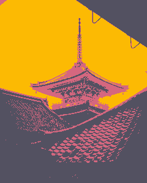

# posterust
[](https://travis-ci.com/okaneco/posterust)
[](https://crates.io/crates/posterust)

Reduce images to simple values, pick the values you want to show. Designed to help with value studies, exploring tonal shapes, experimenting with compositions, making fun image edits, or being the ground work for your next creation.

`posterust` was created to explore paramerized posterization for a finer, more "artistic" control. Not limited to equal divisions of value, users can include any of the values they want from 0 (black) to 10 (white). Custom colors can be included to give life to the greyscale.

## Features
- 2 to 11 step greyscale posterization
- custom, multiple posterization thresholds
- custom colors for posterization levels
- save as `.jpg` or `.png`
- batch process images

## Examples
### 1) `posterust FILE -v 2,9 -k`


The value groupings look like this with the `-k` flag present. The value thresholds are separated into `255/[number of values]`-sized buckets.
```
[0, 0, 0, 0, 0, 0, 0, 0, 0, 127, 127]
```
Without `-k`, the groupings are
```
[46, 46, 46, 46, 46, 46, 46, 46, 46, 207, 207]
```
which results in the following image where brightness values below `Luma(207)` turn into a grey with `rgb(46,46,46)` and above turn into a grey with `rgb(207,207,207)` which gives a nice silhouette or notan. Both modes have their advantages and affect how the images are rendered.


### 2) `posterust FILE -v 2,7,9 -c 535161,d5677f,fcba03 -k`


The value flag works by mapping the 11 values to the ranges declared by the user. In this example, values `0-6` will be mapped to `2`, `7-8` to `7`, and `9-10` to `9`.

### 3) `posterust FILE -n 5 -c 693787,c14281,fa6a67,ffaa4d,faf059`


Using `-n` splits the buckets for each value range to be `255/n` per bucket. In this example, each bucket contains `51` luma values before the next threshold.

### 4) `posterust FILE -v 0,3,5,7,9 -k`


Black and white example with values split up as follows.
```
[0, 0, 0, 51, 51, 102, 102, 153, 153, 204, 204]
```

---

The colors in the examples were generated using the tool [`palgrad`](https://github.com/okaneco/palgrad).

#### Photo attribution:
Pagoda - lifeofwu/johnmwu  
Model - daria/dariashevtsova  
Images that examples were created from are located in `/gfx/`.

## License
This crate is licensed under either
- the [MIT License](LICENSE-MIT), or
- the [Apache License (Version 2.0)](LICENSE-APACHE)

at your option.
